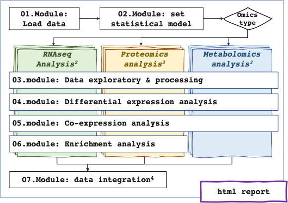

# RFLOMICS: R package and Shiny interface for Integrative analysis of omics data

The acquisition of **multi-omics data** in the context of **complex experimental design** is a widely used practice to identify features (transcripts, proteins, metabolites,...) and decipher the biological processes they are involved in. The investigation of each omics layer is a good first step to explore and extract relevant biological variability. The statistical integration could then be restrained to pertinent omics levels and features. Such analysis of heterogeneous data remains a technical challenge with the needs of expertise methods and parameters to take into account data specificity. Furthermore, applying different statistical methods from several tools is also a technical challenge in term of data management. In this context, we developed RFLOMICS.

**RFLOMICS** is an R package and Shiny interface that offers guided, comprehensive, and reproducible analysis within a framework designed to manage multiple omics datasets. The interface provides remarkable flexibility, enabling users to seamlessly navigate between result exploration and visualization.



**Specifications:**

- Performs complete multi-omics project analysis,
- Support multi-factorial experimental design (up to 3 biological factors), 
- Guarantees the relevance of the used methods,
- Reduces the analysis time on the unavoidable steps,
- Ensure the reproducibility of omics analysis,
- Accessible via one and simple user-friendly interface

**Constraints:**

- 3 types of omics data : RNAseq (read count), metabolomics (abundance) and proteomics (abundance)
- less than 10 datasets per omics type.
- 1 to 3 biological factors
- 1 to 2 batch factors and at least 3 replicates per condition
- Complete (mandatory) and balanced (recommended) design 

## Use RFLOMICS

### SK8 platform
You can access the RFLOMICS app on Sk8 using this url: 

https://RFLOMICS.sk8.inrae.fr/

WARNING: only 2 Gb of ram available per app, we recommend using the SK8 solution 
only if your data have a small number of samples and features. 

### Locally 

#### Install from github using remotes 
In a R console, use the following command to install from the github repository:

``` r
remotes::install_github("https://github.com/RFLOMICS/RFLOMICS")
```

#### Install with git repository 

You can clone the repository from GitHub using the following command in a 
shell terminal: 

```  
git clone git@github.com:RFLOMICS/RFLOMICS.git
```

In a R console, set the working directory to the git repository, then install
the package:

``` r
setwd("RFLOMICS/")
remotes::install_local(upgrade="never")
```

### Troubleshooting MOFA2

RFLOMICS uses the R package [MOFA2](https://www.bioconductor.org/packages/release/bioc/html/MOFA2.html). 
This package depends on a python script and this
can lead to several issues. The first step is to consult the MOFA2 troubleshooting
[FAQ](https://biofam.github.io/MOFA2/troubleshooting.html) on their website.

If none of the proposed solutions are resolving your issues, you can try some
additional steps and verification. 

1. Install [Python](https://www.python.org/downloads/) or make sure you have it installed.

You can check you have python installed by running `which python` in a shell terminal. 
On windows, replace with `where python`. You should be able to see the path(s) were
Python binaries are installed. You can have multiple python version installed at once.
You have to make sure the one used by R is this correct one. 

2. Install a python environment (conda, miniconda, anaconda, ...)
3. Install pip command (if not already done). For windows users, you can use [this guide](https://phoenixnap.com/kb/install-pip-windows).
4. Install mofapy 2: in a shell terminal, run `pip install mofapy2`.

You can check your configuration using `reticulate::py_config()` and 
`reticulate::py_list_packages()` in R. 
Your Python binary path and mofapy2 (not mofapy!) path should appear 
after step 5. If it's not the case, something went wrong. 
If your python environment and mofapy2 package are correctly listed, 
ignore step 5 and skip to step 6.

5. Set the value of the RETICULATE_PYTHON environment variable to a Python 
binary and restart your session:
* either manually indicate it in your .Rprofile (hidden file) 
* or use the following command in a terminal, in the .Rprofile folder:

```
echo "Sys.setenv(RETICULATE_PYTHON = \"path_to_python_bin\")" >> .Rprofile
```
6. Install MOFA2 using `BiocManager::install("MOFA2")` in R. 


## Run RFLOMICS

To run RFLOMICS, use the runRFLOMICS() function:

``` r
library(RFLOMICS)
runRFLOMICS()
```

## Licence
Artistic-2.0


## Contact and support
[ijpb-bioinfo-team](mailto:ijpb-bioinfo-team@inrae.fr) (ijpb-bioinfo-team@inrae.fr)

## References
-   [CATI Sysmics](https://sysmics.cati.inrae.fr/),
-   [Lambert I. et al. (2020)](https://plantmethods.biomedcentral.com/articles/10.1186/s13007-020-00611-7)
-   [Efstathiou G, et al. 2017](https://academic.oup.com/nar/article/45/W1/W300/3829200)
