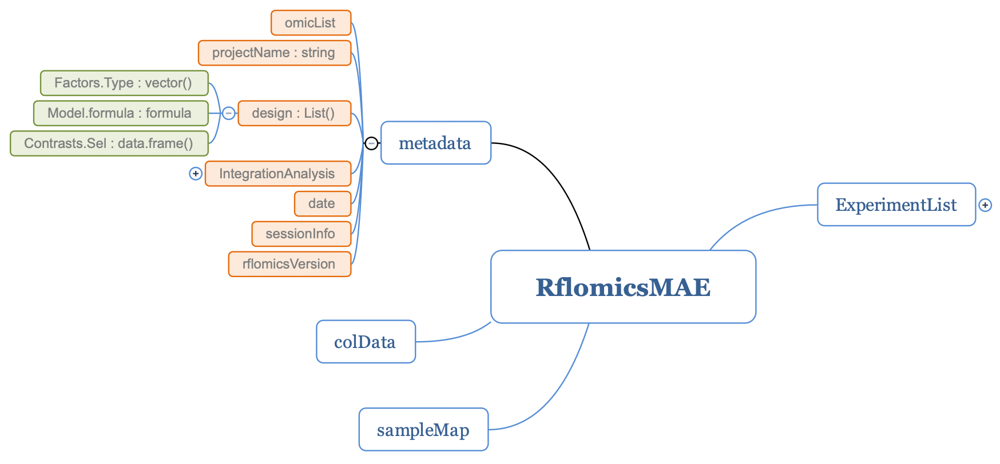
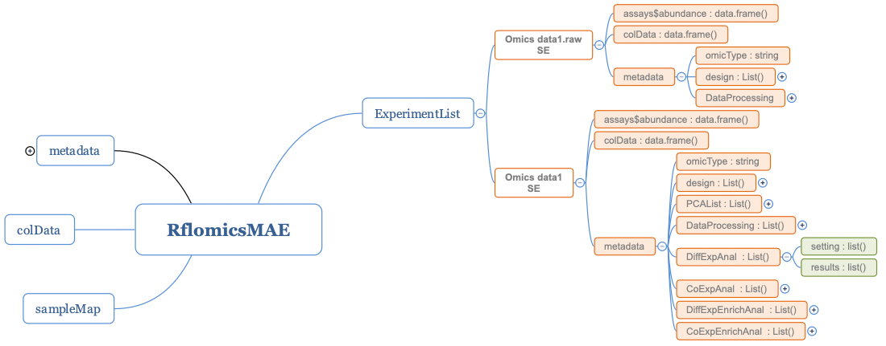
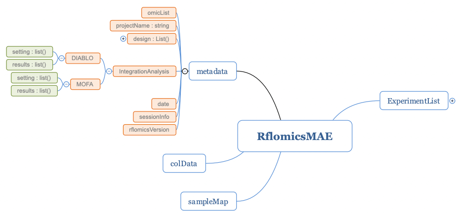

```{r, echo = FALSE}
knitr::opts_chunk$set(
  collapse = TRUE,
  warning = FALSE,
  message = FALSE,
  echo = TRUE,
  comment = "#>"
)
```

# Introduction

RFLOMICS is a R package that provides a complete workflow for the analysis of multi-omics data within complex experimental designs framework. The package was firstly designed to be used through a user interface (see `RFLOMICS` vignette), but has been developed in an object oriented programming with a limited number of classes and methods.This allow to run data analysis as command line in a workflow with the "\|\>" operator, each step being a method of the extended [MultiAssayExperiment](https://bioconductor.org/packages/MultiAssayExperiment/) or [SummarizedExperiment](https://bioconductor.org/packages/SummarizedExperiment/) classes.

# The RflomicsMAE and RflomicsSE classes

To ensure an efficient data management (statistical design, data, analysis parameters and results) the [MultiAssayExperiment](https://bioconductor.org/packages/MultiAssayExperiment/) and [SummarizedExperiment](https://bioconductor.org/packages/SummarizedExperiment/) classes were extended to fix an organization for the metadata slot. The RflomicsMAE class (which extends the [MultiAssayExperiment](https://bioconductor.org/packages/MultiAssayExperiment/) class) stores the statistical design and multi-omics data integration analysis parameters and results in the metadata slot. It contains an ExperimentList of RflomicsSE (which extends the [SummarizedExperiment](https://bioconductor.org/packages/SummarizedExperiment/) class), storing analysis parameters and results in the metadata slot.

In this vignette, we will use an example to show how the metadata slots of the two RflomicsMAE and RflomicsSE objects are organised and can be accessed.

RFLOMICS workflow is structured into three main parts:

-   The first one involves loading the experimental design and omics data, setting up the statistical model, and defining contrasts (hypotheses) associated with the biological questions. The design list of the metadata slot of the RflomicsMAE object stores this statistical settings (in green in Fig 1).

{width="100%"}

-   The second part allows for complete single-omics analysis for each dataset. Both raw and processed omic datasets are stored in the ExperimentList as RflomicsSE. For each analysis step, settings and results are stored (in green in Fig 2)

    1.  The DataProcessing list of the metadata slot keeps the pre-processing settings and results which include filtering, normalization and transformation.

    2.  The DiffExpAnal list of the metadata slot stores the differential expression analysis settings and results.

    3.  The CoExpAnal list of the metadata slot stores co-expression analysis on differentially expressed entities settings and results.

    4.  DiffExpEnrichAnal and CoExpEnrichAnal lists of the metadata slot keep functional enrichment analysis results and settings for respectively the Differential expression analysis and CoExpression analysis.

{width="150%"}

-   The third part is the multi-omics integration, with two proposed methods: a supervised approach using the MixOmics package (DIABLO), and an unsupervised approach using MOFA2. (settings and results stored in RflomicsMAE object)

{width="100%"}

As you will see, this analysis workflow is implemented as methods of the two classes (RflomicsMAE and RflomicsSE), providing a generic interface regardless of the type of omics data being analyzed (RNAseq, proteomics, metabolomics, etc.). This methods will return the same class of object (RflomicsSE or RflomicsMAE) as the entry object type with the metadata slot enriched with the parameters and results. We also defined getter and setter to access this objects.

# Methods for RflomicsMAE and RflomicsSE classes

## Instantiate a RflomicsMAE object from a MAE object

In this example we will instantiate a RflomicsMAE object from an existing MAE object and a design data.frame.

We will use the ecoseed dataset from the RFLOMICS package.

This dataset is a multi-omics dataset composed of three data matrices: transcriptomic (raw RNAseq read count data matrix), metabolomic and proteomic (relative abundance matrix as XIC) that investigates the effect of seed production temperature on the germination potential of Arabidopsis thaliana.

The experimental design has three factors:

\- Repeat: batch factor with three conditions: rep1, rep2, rep3

\- temperature: biological factor with three conditions: Low, Medium, Elevated

\- imbibition: biological factor with three conditions: DS (Dry Deed), EI (Early Imbibition), LI (Late Imbibition)

Important informations are required to complete the design and create the RflomicsMAE object. Experimental factors have to be defined with their type (batch or biological) and a reference level. This informations will be crucial to define the statistical model and the contrasts.

PCA on raw data is done on raw data during the RflomicsMAE instantiation.

```{r, echo=FALSE}
library(RFLOMICS)
```

```{r createRlomisMAE}

data(ecoseed.mae)

factorInfo <- data.frame(
  "factorName"   = c("Repeat", "temperature", "imbibition"),
  "factorType"   = c("batch", "Bio", "Bio"),
  "factorRef"    = c("rep1", "Low", "DS")
)

# create rflomicsMAE object with ecoseed data
MAE <- createRflomicsMAE(
  projectName = "Tests",
  omicsData   =  ecoseed.mae,
  omicsTypes  = c("RNAseq","proteomics","metabolomics"),
  factorInfo  = factorInfo)

names(metadata(MAE))

head(getDesignMat(MAE))


```

## Main methods presentation

Omics data are heterogeneous and each omics require specific methods and parameters to take into account the nature of data. Rflomics has a set of generic methods than can be applied either to the `RflomicsMAE` or `RflomicsSE` objects and which adapt methods and parameters to the type of omics data: RNAseq, proteomics, metabolomics. When applied to a `RflomicsMAE` object, the name of the `RflomicsSE` object has to be given with the parameter (SE.name).

The main methods are:

| Methods                 | Description                                                                                                     |
|:----------------------|:------------------------------------------------|
| createRflomicsMAE       | instantiate a RflomicsMAE object from a MultiAssayExperiment object and a design data.frame                     |
| runDataProcessing       | run the data processing (filtering: features or samples, normalization and/or transformation, PCA               |
| runDiffAnalysis         | run a Differential features analysis on omics data                                                              |
| runCoExpression         | run a CoExpression analysis from the union/intersection of differentially expressed features list.              |
| runAnnotationEnrichment | run an annotation enrichment analysis (GO, KEGG, custom) of the list of differentially or co-expressed features |
| runOmicsIntegration     | run an integration analysis (MOFA or DIABLO)                                                                    |

Table 1: Main methods for the RflomicsMAE and RflomicsSE classes to run a multi-omics analysis workflow

## Run the workflow:

### Set the statistical design: model and contrasts

The next step is to define the model and associated contrasts translating biological question in statistical terms. The function `generateModelFormulae` finds all possible models given the experimental design settings. Only the second order interaction terms between the biological factors appear. Batch factors never appear in interaction terms. For the remaining of the example, we select the second formula.

-   set the model formulae

```{r designMetadata}

form <- generateModelFormulae(MAE)
form


MAE <- setModelFormula(MAE, form[2])


getModelFormula(MAE)

```

Given the chosen formula, all hypotheses (contrasts) can be obtained using the `generateExpressionContrast` function. In this example, we will select the three first contrasts of the averaged contrasts.

-   set contrasts:

```{r contr}

possibleContrasts <- generateExpressionContrast(MAE)
possibleContrasts$averaged$contrastName

MAE <- setSelectedContrasts(MAE, contrastList = possibleContrasts$averaged[1:3])


getSelectedContrasts(MAE)[,-c(1,3)]

```

This statistical framework will be applied on all loaded datasets.

### Run single-omics analysis

#### Run data processing and quality check

Processing of data, including: normalization and transformation settings and results can be run in one step using the `runDataProcessing` method. Or in multiple step thanks to the methods called by `runDataProcessing` which are: `filterLowAbundance` (`RNAseq`), `runNormalization` and `runTransformData`.

In this example, the three omics data are processed in one step.

```{r runNorm}

MAE <- runDataProcessing(object = MAE, 
                               SE.name = "RNAtest", 
                               samples = colnames(MAE[["RNAtest"]])[-1], 
                               lowCountFiltering_strategy = "NbReplicates", 
                               lowCountFiltering_CPM_Cutoff = 1, 
                               normMethod = "TMM") |>
    runDataProcessing(SE.name = "metatest", normMethod = "median",
                      transformMethod = "log2") |>
    runDataProcessing(SE.name = "protetest", transformMethod = "log2") |> 
    runOmicsPCA(SE.name = "metatest")

# Access to the normalization settings for metabolomics data

getNormSettings(object = MAE[["metatest"]])

# Obtain the list of filtered features for the RNAseq data

getFilteredFeatures(object = MAE[["RNAtest"]])[1:10]

```

It is important to note that none of the data are directly transformed in the assay, except if specifically asked by the user with setting the argument `modifyAssay` to TRUE. This way, you can always change your mind and test several normalization or transformation processes.

You can access to processing results and plot them.

```{r plotPCA, fig.width=10, fig.height=5, fig.show = "hold"}

plotOmicsPCA(MAE[["metatest"]], raw = "raw")
plotOmicsPCA(MAE[["metatest"]], raw = "norm")

```

```{r plotDataDistribution, fig.width=10, fig.height=5, fig.show = "hold"}

plotDataDistribution(MAE[["metatest"]], raw = TRUE)
plotDataDistribution(MAE[["metatest"]], raw = FALSE)

```

#### Run differential analysis: settings and results

Differential analysis on contrasts can be run using the `runDiffAnalysis` method. This method is specialized for each omics type and uses the `limma` package for proteomics and metabolomics data and the `edgeR` package for RNAseq data. The method returns the same object with the metadata slot enriched with the parameters and results of the analysis.

```{r diff}

MAE <- runDiffAnalysis(MAE , SE.name = "RNAtest", p.adj.method = "BH", 
                    method = "edgeRglmfit", p.adj.cutoff = 0.05, 
                    logFC.cutoff = 0) |>
    runDiffAnalysis(SE.name = "protetest", p.adj.method = "BH", 
                    method = "limmalmFit",  p.adj.cutoff = 0.05, 
                    logFC.cutoff = 0) |>
    runDiffAnalysis(SE.name = "metatest", p.adj.method = "BH", 
                    method = "limmalmFit",  p.adj.cutoff = 0.05, 
                    logFC.cutoff = 0)

# access to the settings

getDiffSettings(MAE, SE.name = "RNAtest")

# Summary of the differential analysis

sumDiffExp(MAE[["RNAtest"]])
```

```{r volcano, fig.width=7, fig.height = 4.5, fig.align="center"}

plotDiffAnalysis(MAE, 
                 SE.name = "RNAtest", 
                 contrastName = "(temperatureMedium - temperatureLow) in mean", 
                 typeofplots = "volcano")

```

```{r boxplot, fig.width=7, fig.align="center"}

plotBoxplotDE(MAE[["RNAtest"]], 
              features = "AT4G04810")
```

#### Run co-expression analysis: settings and results

Co-expression analysis on list of differentially expressed features can be run using the `runCoExpression` method. This method uses methods from the `coseq` package with a set of optimal parameters adatped to each omics. In this example, we will run a co-expression analysis on the `proteomics` data.

The results can be plot using the `getCoExpAnalysesSummary` method.

A co-expression profile can be plotted for a given cluster using the `plotCoExpressionProfile` function.

```{r coexp}

MAE <- runCoExpression(MAE, SE.name = "protetest", 
                       K = 2:5, replicates = 5, 
                       merge = "union")

getCoExpAnalysesSummary(MAE)

plotCoExpressionProfile(MAE[["protetest"]], cluster = 2)
```

#### Run annotation enrichment analysis: settings and results

Annotation enrichment analysis can be run using the `runAnnotationEnrichment` method. This method uses the `clusterProfiler` package. In this example, the `org.At.tair.db` database for Arabidopsis thaliana will be used to perform the GO enrichment analysis of the list of DE proteins.

The results can be accessed using the `getEnrichRes` method and plotted using the `plotEnrichComp` method.

```{r enrich}

MAE <- runAnnotationEnrichment(MAE, SE.name = "protetest",
                               list_args = list(OrgDb = "org.At.tair.db",
                                                 keyType = "TAIR",
                                                 pvalueCutoff = 0.05),
                                from = "DiffExp", database = "GO",
                                domain = "CC")

results <- getEnrichRes(MAE[["protetest"]],
                         from = "diffexp", database = "GO")

plotEnrichComp(MAE[["protetest"]], from = "DiffExp",database = "GO", 
               matrixType = "FC")

```

### Run a multi-omics integration analysis

The multi-omics step in RFLOMICS takes two steps: the preparation of the object, based on the user-selected method, and the actual run of the selected method. This is done using `prepareForIntegration` and `runOmicsIntegration`. In this example, we will use only the proteomics and metabolomics dataset with the mixOmics package (block.plsda function).

`prepareForIntegration` does not return a RflomicsMAE object, it returns the corresponding type to be an input for either MOFA2 or mixOmics functions.

```{r}
listIntegration <- prepareForIntegration(MAE, 
                                         omicsNames = c("metatest", "protetest"),
                                         method = "mixOmics")

MAE <- runOmicsIntegration(object = MAE, 
                                  preparedObject = listIntegration, 
                                  method = "mixOmics", 
                                  selectedResponse = "temperature", 
                                  ncomp = 3)
```

Visualizing results is made through the original package functions.

```{r, fig.width = 7, fig.align = "center"}
mixOmics::plotIndiv(getMixOmics(MAE, response = "temperature"))
```

# Session information

```{r}
sessionInfo()
```
