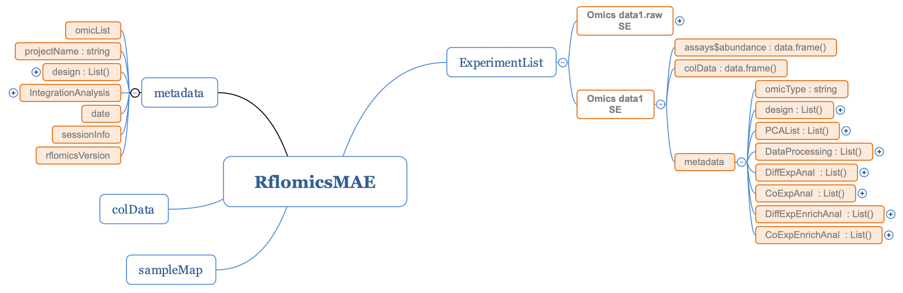

```{r, echo = FALSE}
knitr::opts_chunk$set(
  collapse = TRUE,
  warning = FALSE,
  message = FALSE,
  echo = TRUE,
  comment = "#>"
)
```

# Introduction

RFLOMICS is a R package that provides a complete workflow for the analysis of multi-omics data within complex experimental designs framework. The package was originally designed to be used through a user interface (see `RFLOMICS` vignette), but has been developed in an object oriented programming with a limited number of classes and methods. This allow to run data analysis as command line in a workflow with the "\|\>" operator, each step being a method of the extended [MultiAssayExperiment](https://bioconductor.org/packages/MultiAssayExperiment/) or [SummarizedExperiment](https://bioconductor.org/packages/SummarizedExperiment/) classes.

# The RflomicsMAE and RflomicsSE classes

To ensure efficient data management the [MultiAssayExperiment](https://bioconductor.org/packages/MultiAssayExperiment/) and [SummarizedExperiment](https://bioconductor.org/packages/SummarizedExperiment/) classes were extended to fix an organization for the metadata slot. The statistical design and analysis parameters of the multi-omics data integration are stored in the `metadata` slot of the `RflomicsMAE` class, while the parameters and results of the single-omics are stored in the `metadata` slot of `RflomicsSE` objects of the `ExperimentList`.

This organisation can be illustred by presenting the workflow of the RFLOMICS package.

The workflow is structured in three main parts:

-   The first consists of loading the experimental design and omics data, setting up the statistical model and defining the contrasts (hypotheses) associated with the biological questions. The design list of the metadata slot of the RflomicsMAE object stores this statistical settings (in green in Fig 1).

{width="100%"}

-   The second part allows a complete single-omics analysis for each dataset. The raw and processed omic datasets are stored in the ExperimentList as RflomicsSE. For each analysis step, settings and results are stored (in green in Fig 2)

    1.  The DataProcessing list in the metadata slot contains the parameters and results of pre-processing including filtering, normalisation and transformation

    2.  The DiffExpAnal list in the metadata slot contains the parameters and results of the differential expression analysis.

    3.  The CoExpAnal list in the metadata slot stores the parameters and results of the coexpression analysis on differentially expressed entities.

    4.  DiffExpEnrichAnal and CoExpEnrichAnal lists in the metadata slot store the results and parameters of the functional enrichment analysis for the differential expression and the coexpression analysis, respectively.

{width="150%"}

-   The third part is the multi-omics integration, with two proposed methods: a supervised approach using the MixOmics package (DIABLO), and an unsupervised approach using MOFA2. (settings and results stored in RflomicsMAE object)

{width="100%"}

As you will see, this analysis workflow is implemented as methods of the two classes (`RflomicsMAE` and `RflomicsSE`), providing a generic interface whatever the type of omics data being analysed (RNAseq, proteomics, metabolomics, etc.). These methods return the same class as the input object (`RflomicsMAE` and `RflomicsSE`) with the metadata slot enriched with parameters and results. Getter and Setter methods have been defined to access the metadata objects.

# Methods for RflomicsMAE and RflomicsSE classes

## Instantiating a RflomicsMAE object from a MAE object

In this example we will instantiate a RflomicsMAE object from an existing MAE object and a design data.frame. We will use the ecoseed dataset from the RFLOMICS package (see `data(ecoseed)`).

`ecoseed` is a multi-omics dataset composed of three data matrices: transcriptomic (raw RNAseq read count data matrix), metabolomic and proteomic (relative abundance matrix as XIC) obtained from a study examining the effect of seed production temperature on the germination potential of Arabidopsis thaliana.

The experimental design includes three factors:

\- Repeat: batch factor : rep1, rep2, rep3

\- temperature: biological factor with three conditions: Low, Medium, Elevated

\- imbibition: biological factor with three conditions: DS (Dry Deed), EI (Early Imbibition), LI (Late Imbibition)

Crucial informations is needed to complete the design and create the RflomicsMAE object. Experimental factors must be defined with their type (batch or biological) and a reference level. These informations are used to automatically generate the statistical design.

PCA on raw data is performed during the instantiation of the RflomicsMAE object.

```{r, echo=FALSE}
library(RFLOMICS)
```

```{r createRlomisMAE}

data(ecoseed.mae)

factorInfo <- data.frame(
  "factorName"   = c("Repeat", "temperature", "imbibition"),
  "factorType"   = c("batch", "Bio", "Bio"),
  "factorRef"    = c("rep1", "Low", "DS")
)

# create rflomicsMAE object with ecoseed data
MAE <- createRflomicsMAE(
  projectName = "Tests",
  omicsData   =  ecoseed.mae,
  omicsTypes  = c("RNAseq","proteomics","metabolomics"),
  factorInfo  = factorInfo)

names(metadata(MAE))

head(getDesignMat(MAE))


```

## Overview of the main methods

Omics data is heterogeneous and each omics requires specific methods and parameters to take into account of the nature of data. Rflomics has a set of generic methods than can be applied to the `RflomicsMAE` or `RflomicsSE` objects and which adapt the methods and parameters to the type of omics data: RNAseq, proteomics, metabolomics.

The main methods are:

| Methods                 | Description                                                                                                         |
|:-----------------------|:-----------------------------------------------|
| createRflomicsMAE       | instantiate a RflomicsMAE object from a MultiAssayExperiment object and a design data.frame                         |
| runDataProcessing       | Process data: filtering: features or samples, normalization and/or transformation, PCA                              |
| runDiffAnalysis         | perform a Differential features analysis on omics data                                                              |
| runCoExpression         | perform a CoExpression analysis from the union/intersection of differentially expressed features list.              |
| runAnnotationEnrichment | perform an annotation enrichment analysis (GO, KEGG, custom) on the list of differentially or co-expressed features |
| runOmicsIntegration     | perform an integration analysis (MOFA or DIABLO)                                                                    |
| generateReport          | generate a report from the RflomicsMAE object and optionally export the report and results                          |

Table 1: Main methods of the RflomicsMAE and RflomicsSE classes for running a multi-omics analysis workflow.

When applied to a `RflomicsMAE` object, the name of the `RflomicsSE` object must be specified with the `SE.name` parameter.

## Executing the workflow :

### Define the statistical settings: model and contrasts

The next step is to define the model and associated contrasts by translating the biological question into statistical terms. The `generateModelFormulae` function is used to find all possible models given the experimental design settings.

Rlfomics accepts up to three biological factors and one batch effect. Only second-order interaction terms between biological factors will appear in the model formulae. Batch factors will never appear in the interaction terms. For the rest of the example, we choose the second formula. The model without the interaction term.

-   set the model formulae

```{r designMetadata}

form <- generateModelFormulae(MAE)
form


MAE <- setModelFormula(MAE, form[2])


getModelFormula(MAE)


```

Given the formula chosen, all the hypotheses (contrasts) can be obtained using the `generateExpressionContrast` function. Three types of contrast are expressed: pairwise comparison, average expression and interaction expression.

In this example, we will select the first three contrasts from the averaged contrasts.

-   set contrasts:

```{r contr}

possibleContrasts <- generateExpressionContrast(MAE)
possibleContrasts$averaged$contrastName

MAE <- setSelectedContrasts(MAE, contrastList = possibleContrasts$averaged[1:3])

getSelectedContrasts(MAE)[,-c(1,3)]

```

This statistical framework will be applied on all loaded datasets.

### Single-omics analysis

#### Data processing and quality control

Data processing, including normalisation and transformation parameters and results, can be carried out in a single step using the `runDataProcessing` method. Or in several steps using the methods called by `runDataProcessing`, which are: `filterLowAbundance` (`RNAseq`), `runNormalization` and `runTransformData`.

In this example, the three omics data sets are processed in a single step.

```{r runNorm}

MAE <- runDataProcessing(object = MAE, 
                               SE.name = "RNAtest", 
                               samples = colnames(MAE[["RNAtest"]])[-1], 
                               filterStrategy = "NbReplicates", 
                               cpmCutoff = 1, 
                               normMethod = "TMM") |>
    runDataProcessing(SE.name = "metatest", normMethod = "median",
                      transformMethod = "log2") |>
    runDataProcessing(SE.name = "protetest", normMethod = "none", 
                      transformMethod = "log2") |> 
    runOmicsPCA(SE.name = "metatest")

# Access to the normalization settings for metabolomics data

getNormSettings(object = MAE[["metatest"]])

# Obtain the list of filtered features for the RNAseq data

getFilteredFeatures(object = MAE[["RNAtest"]])[1:10]

```

It is important to note that none of the data is directly transformed in the assay, unless the user specifically requests it by setting the `modifyAssay` argument to TRUE. This way, you can always change your mind and test several normalisation or transformation processes.

You can access to processing results and plot them.

```{r plotPCA, fig.width=10, fig.height=5, fig.show = "hold"}

plotOmicsPCA(MAE[["metatest"]], raw = "raw")
plotOmicsPCA(MAE[["metatest"]], raw = "norm")

```

```{r plotDataDistribution, fig.width=10, fig.height=5, fig.show = "hold"}

plotDataDistribution(MAE[["metatest"]], raw = TRUE)
plotDataDistribution(MAE[["metatest"]], raw = FALSE)

```

#### Differential analysis: settings and results

Differential analysis on each contrasts can be performed using the `runDiffAnalysis` method. This method is specialized for each omics type and uses the `limma` package for proteomics and metabolomics data and the `edgeR` package for RNAseq data. The method returns the same object with the metadata slot enriched with the parameters and results of the analysis.

```{r diff}

MAE <- runDiffAnalysis(MAE , SE.name = "RNAtest", p.adj.method = "BH", 
                    method = "edgeRglmfit", p.adj.cutoff = 0.05, logFC.cutoff = 0) |>
    runDiffAnalysis(SE.name = "protetest", p.adj.method = "BH", 
                    method = "limmalmFit",  p.adj.cutoff = 0.05, logFC.cutoff = 0) |>
    runDiffAnalysis(SE.name = "metatest", p.adj.method = "BH", 
                    method = "limmalmFit",  p.adj.cutoff = 0.05, logFC.cutoff = 0)

# access to the settings

getDiffSettings(MAE, SE.name = "RNAtest")

# Summary of the differential analysis

sumDiffExp(MAE[["RNAtest"]])
```

```{r volcano, fig.width=7, fig.height = 4.5, fig.align="center"}

plotDiffAnalysis(MAE, 
                 SE.name = "RNAtest", 
                 contrastName = "(temperatureMedium - temperatureLow) in mean", 
                 typeofplots = "volcano")

```

```{r boxplot, fig.width=7, fig.align="center"}

plotBoxplotDE(MAE[["RNAtest"]], 
              feature = "AT4G04810")
```

#### Co-expression analysis: settings and results

Co-expression analysis on the list of differentially expressed features can be performed using the `runCoExpression` method. This method uses methods from the `coseq` package with a set of optimal parameters tailored to each omics. In this example, we will perform a co-expression analysis on the `proteomics` data.

The results can be plot using the `getCoExpAnalysesSummary` method.

A co-expression profile can be plotted for a given cluster using the `plotCoExpressionProfile` function.

```{r coexp}

MAE <- runCoExpression(MAE, SE.name = "protetest", 
                       K = 2:5, replicates = 5, 
                       merge = "union")

getCoExpAnalysesSummary(MAE)

plotCoExpression(MAE[["protetest"]])$ICL

plotCoExpressionProfile(MAE[["protetest"]], cluster = 2)
```

#### Annotation enrichment analysis: settings and results

Annotation enrichment analysis can be performed using the `runAnnotationEnrichment` method. This method uses the `clusterProfiler` package. In this example, the `org.At.tair.db` database for Arabidopsis thaliana will be used to perform the GO enrichment analysis of the DE protein list.

The results can be viewed using the `getEnrichRes` method, a summary of the number of enriched terms by the `sumORA` function and plotted, by example, using the `plotEnrichComp` method.

```{r enrich}

MAE <- runAnnotationEnrichment(MAE, SE.name = "protetest",
                               list_args = list(OrgDb = "org.At.tair.db",
                                                 keyType = "TAIR",
                                                 pvalueCutoff = 0.05),
                                from = "DiffExp", database = "GO",
                                domain = "CC")

results <- getEnrichRes(MAE[["protetest"]],
                         from = "diffexp", database = "GO")

sumORA(MAE[["protetest"]], from = "DiffExp", database = "GO")

plotEnrichComp(MAE[["protetest"]], from = "DiffExp",database = "GO", 
               matrixType = "FC")

```

### Multi-omics integration analysis

The multi-omics step in RFLOMICS takes two steps: the preparation of the object, based on the user-selected method, and the actual run of the selected method. This is done using `prepareForIntegration` and `runOmicsIntegration`. In this example, we will use only the proteomics and metabolomics dataset with the mixOmics package (block.plsda function).

`prepareForIntegration` does not return a RflomicsMAE object, it returns the corresponding type to be an input for either MOFA2 or mixOmics functions.

```{r}
listIntegration <- prepareForIntegration(MAE,
                                         omicsNames = c( "protetest", "metatest"),
                                         variableLists = rownames(MAE),
                                         method = "mixOmics")

MAE <- runOmicsIntegration(object = MAE, 
                                  preparedObject = listIntegration, 
                                  method = "mixOmics", 
                                  selectedResponse = "temperature", 
                                  ncomp = 3)
```

Visualizing results is made through the original package functions.

```{r, fig.width = 7, fig.align = "center"}
mixOmics::plotIndiv(getMixOmics(MAE, response = "temperature"))
```

# Generating a report from the RflomicsMAE object

The `generateReport` function is used to generate a report from a RflomicsMAE object. The report is generated in HTML format.

The MAE object can be saved (export = TRUE), exporting the object in a .RData, the report in html format, the graphs in png format and the data in txt (tabulated) format.

```{r report, eval = TRUE}

# generateReport(object = MAE, fileName = "ecoseed_report.html", export = FALSE)

```

# Session information

```{r}
sessionInfo()
```
